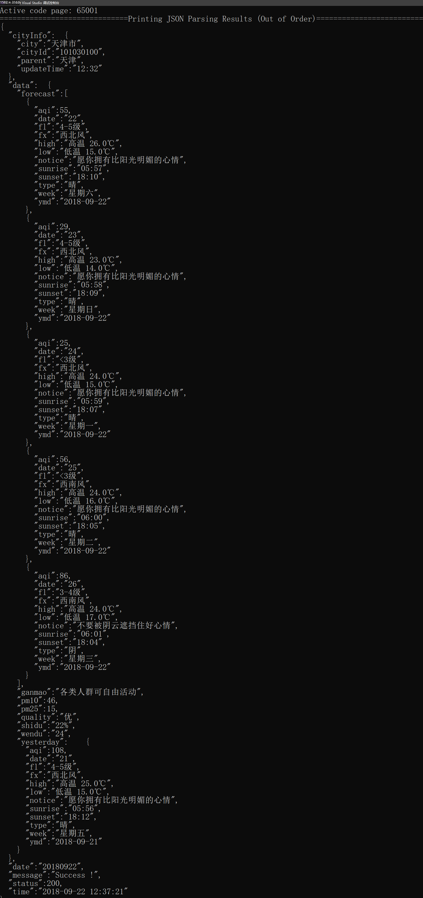
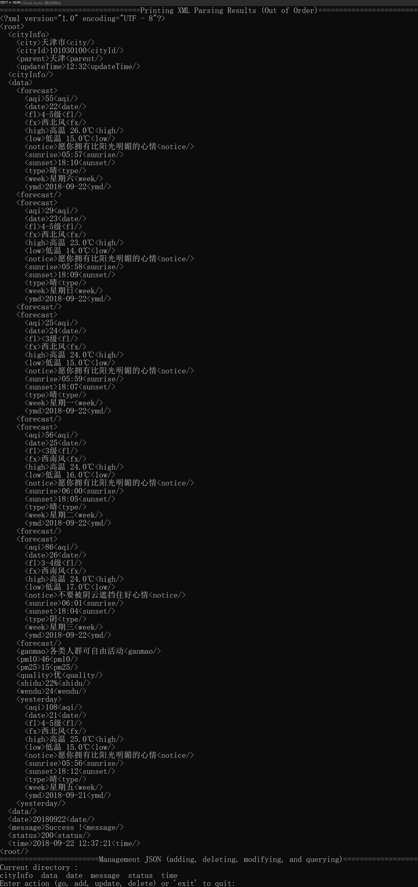
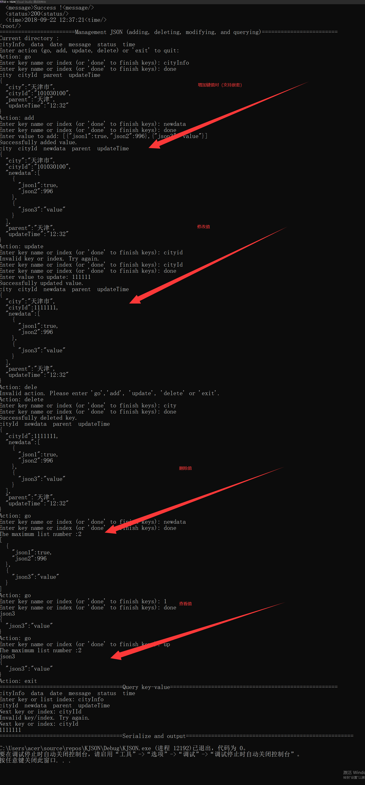
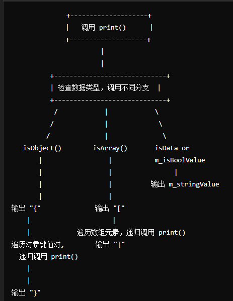
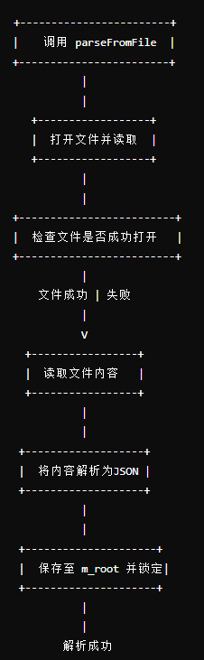
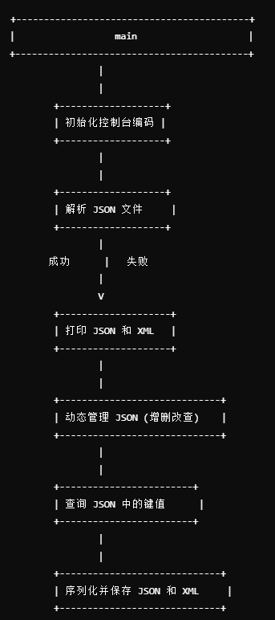

**题目： 用户自定义JSON解析和封装**

作业基本要求： 对json文件解析并设计KJson类支持从xx.json文件解析字符串和生成JSON序列化对象，并写入到xx.json文件中。（已全部完成）

1. 基本功能：（**已全部完成**）
要求支持解析和生成以下数据类型：
字符串
整数
浮点数
布尔值
空值（null）
对象（嵌套JSON对象）
数组（支持嵌套数组）

2. 进阶功能：（**已全部完成**）
支持动态键名 ： 允许使用动态生成的键名进行键值对的添加和访问，支持运行时生成键名的场景。
XML序列化格式支持： 扩展序列化功能，使其支持JSON序列化转为XML序列化。
多线程安全：确保对多线程环境中对JSON对象访问和修改不会产生竞争条件。

**==========================================整体代码思路=============================================**

文件分为：五个文件
　　jsonvalue.h、jsonvalue.cpp、kJson.h、kJson.cpp、main.cpp
　　jsonvalue.h、jsonvalue.cpp中定义了一个 JsonValue 类，用于表示并操作 JSON 数据结构，包括 JSON 的基本类型（字符串、数字、布尔值、空值）以及复杂类型（对象和数组）。JsonValue 提供多种构造函数以支持不同类型的 JSON 值，并定义了拷贝和移动语义构造。另外，它还包括 JSON 数据的**序列化、反序列化**和 **XML 格式化输出**的功能。
　　kJson.h、kJson.cpp中定义了一个 KJson 类，用于管理 JSON 数据结构的解析、访问、更新、删除和序列化。KJson 类支持JSON文件的读取和写入操作，并提供对 JSON 数据的增删改查、动态管理，以及将 JSON 转换为 XML 的功能。它通过**多线程锁**机制实现线程安全访问和更新。
　　main.cpp中为一个 main 函数，主要用于展示和测试 KJson 类的功能。该程序首先从文件中加载 JSON 数据，然后打印出 JSON 和 XML 格式的数据内容。接着，它进入动态管理模式，允许用户在控制台进行 JSON 数据的**增删改查操作**，最终将更新后的 JSON 数据序列化为 JSON 和 XML 格式并保存到文件中。
　　控制台展示结果见下图片：

**json输出展示：**

**转换为XML控制台输出展示：**

**动态管理部分：**

**======================================JsonValue类的设计==========================================**

jsonValue 类设计思路如下：

1. **多种构造函数**：`JsonValue` 支持多种构造函数，分别用于初始化不同类型的 JSON 数据。使用 `std::shared_ptr` 来管理字符串、对象和数组的存储，确保内存的自动管理。
2. 成员变量设计
   - `m_isString`、`m_isData`、`m_isNullValue` 和 `m_isBoolValue` 这些布尔变量，用于指示数据的具体类型。
   - `m_stringValue`、`m_objectValue`、`m_arrayValue` 分别用于存储 JSON 的字符串、对象和数组数据。
3. **序列化方法**：`serializeToStream` 和 `serializeToXMLStream` 方法实现了 JSON 和 XML 格式的递归输出，`print` 方法实现了控制缩进的 JSON 打印输出。

`print` 代码**流程图**：

### 主要函数说明

1. **构造函数**
   - `JsonValue()`：默认构造函数，初始化字符串、对象、数组为空。
   - `JsonValue(const std::string& stringValue)`：初始化 `JsonValue` 为字符串类型。
   - `JsonValue(const std::string& stringValue, bool isData, bool isNull, bool isBool)`：用于标识 `JsonValue` 是否为数据、空值或布尔类型。
   - `JsonValue(const std::map<std::string, JsonValue>& objectValue)`：初始化为对象类型，使用 `std::map` 存储对象键值对。
   - `JsonValue(const std::vector<JsonValue>& arrayValue)`：初始化为数组类型，使用 `std::vector` 存储数组元素。
2. **类型判断方法**
   - `isObject()`：判断 `JsonValue` 是否为对象类型（即 `m_objectValue` 不为空且不为空对象）。
   - `isArray()`：判断 `JsonValue` 是否为数组类型（即 `m_arrayValue` 不为空且不为空数组）。
3. **数据访问方法**
   - `getStringValue()`：获取 `m_stringValue` 的引用，用于访问字符串值。
   - `getObjectValue()`：获取 `m_objectValue` 的引用，用于访问对象内容。
   - `getArrayValue()`：获取 `m_arrayValue` 的引用，用于访问数组内容。
4. **打印和序列化方法**
   - `print(int indent = 0) const`：递归打印 JSON 内容，带缩进输出。
   - `printKeys(std::vector<std::string>& lastKeys)`：打印对象键，适用于 JSON 中包含的键集合。
   - `serializeToStream(std::ofstream& outfile, int indent = 0) const`：将 `JsonValue` 序列化为 JSON 格式输出到文件流中。
   - `printXML(const std::string& outLayLabel, int indent = 0) const`：递归输出 XML 格式的 `JsonValue` 内容。
   - `serializeToXMLStream(std::ofstream& outfile, const std::string& outLayLabel, int indent = 0) const`：将 `JsonValue` 序列化为 XML 格式输出到文件流中。

这些构造函数、成员函数和打印方法使得 `JsonValue` 成为一个功能丰富的 JSON 数据结构表示类，支持多种类型的 JSON 数据、递归序列化、输出，以及将 JSON 数据导出为 XML 格式。

**=========================================== KJson类的设计=========================================**

**成员变量设计**：

- `m_root`：使用 `std::shared_ptr<JsonValue>` 存储 JSON 对象的根节点。
- `m_mtx`：使用 `std::shared_ptr<std::mutex>`，用于多线程访问时对 `m_root` 的互斥锁定。

**多功能方法设计**：

- `parseFromFile` 方法用于从文件解析 JSON 并生成 `KJson` 对象，`serializeToFile` 和 `serializeXMLToFile` 实现 JSON 和 XML 的序列化。
- `manageJsonData` 方法通过用户输入的操作动态管理 JSON 数据结构。
- `get` 方法实现嵌套键值查询，`deleteKeyValue` 实现嵌套键的删除，`operator[]` 重载实现嵌套键的访问。

**私有工具函数**：如 `skipWhitespace`、`parseString`、`parseData`、`parseArray`、`parseObject` 等，用于解析字符串的具体功能。

`parseFromFile` 函数的**流程图**为：

### 主要函数说明

1. **构造函数**
   - `KJson()`：默认构造函数，初始化空的 JSON 数据。
   - `KJson(const JsonValue& rootValue)`：使用现有的 `JsonValue` 对象初始化 `m_root`，作为 JSON 根节点。
   - `KJson(JsonValue&& rootValue)`：移动构造函数，将临时的 `JsonValue` 对象转移给 `m_root`。
2. **解析和序列化**
   - `parseFromFile(const std::string& filePath)`：从文件加载 JSON 数据，解析后保存到 `m_root`。
   - `serializeToFile(const std::string& filePath) const`：将 `KJson` 对象中的数据序列化为 JSON 文件。
   - `serializeXMLToFile(const std::string& filePath) const`：将 `KJson` 对象的数据序列化为 XML 格式的文件。
3. **动态 JSON 管理**
   - `manageJsonData()`：通过用户输入动态管理 JSON 数据，包括增加、更新和删除数据。
   - `updateLastKey(JsonValue& current, std::vector<std::string>& lastKeys)`：用于更新 JSON 数据层级中的合法键列表，帮助管理 JSON 数据层次。
4. **工具函数**：
   - `parseJson(std::istringstream& ss)`：递归解析 JSON 内容。
   - `parseObject`、`parseArray`、`parseString`、`parseData` 等：用于处理特定 JSON 数据类型的解析。
   - `skipWhitespace`：跳过空白字符，便于解析。
   - `isData`、`isNull`、`isBool`：判断特定数据类型，便于 JSON 内容识别。
5. **JSON 操作和查询**
   - `get(const std::vector<std::string>& keys)`：根据嵌套键查询 JSON 数据，返回对应的 `JsonValue` 指针。
   - `deleteKeyValue(std::vector<std::string> keys)`：根据嵌套键删除 JSON 中的特定键值。
   - `operator[]`：重载 `[]` 操作符，用于支持嵌套键查询和访问。
   - `printJson()` 和 `printXml()`：输出 JSON 和 XML 的内容，支持控制台展示 JSON 数据。

### 核心功能

1. **文件解析和序列化**：
   - `parseFromFile`：从文件中读取 JSON 内容并解析为 `KJson` 对象结构。
   - `serializeToFile` 和 `serializeXMLToFile`：能够将 JSON 数据序列化为 JSON 文件或 XML 文件，支持 JSON 数据的跨格式保存。
2. **嵌套 JSON 操作和查询**：
   - 通过 `get`、`deleteKeyValue`、`operator[]` 等方法支持嵌套查询和修改，使得 `KJson` 类能够方便地进行层级访问。
3. **多线程安全**：
   - `m_mtx` 用于在多线程环境中锁定 JSON 数据的访问，确保数据一致性和安全性。

`KJson` 类实现了一个功能丰富的 JSON 操作类，结合了文件解析、序列化、嵌套查询、键值操作、多线程安全等特性，能够灵活地处理 JSON 数据的读取、修改和导出。

**============================================= main===========================================**

#### 主要作用

1. **从文件中解析 JSON**：从指定路径读取 JSON 文件内容，并解析为 `KJson` 对象。
2. **输出解析结果**：打印 JSON 和 XML 格式的内容到控制台。
3. **动态管理 JSON 数据**：允许用户动态管理 JSON 数据（如增加、删除、修改）。
4. **查询 JSON 键值**：支持用户输入嵌套键名查询 JSON 中的具体键值。
5. **将 JSON 数据保存到文件**：将 JSON 和 XML 格式的数据序列化并保存到指定文件路径。

**主要流程：**

### 代码功能详解

1. **文件解析与结果打印**
   - `json.parseFromFile("D:/tabble/json/input.json")`：从文件路径解析 JSON 内容并将其存储在 `json` 对象中。
   - `json.printJson()`：以 JSON 格式打印解析结果到控制台。
   - `json.printXml()`：以 XML 格式打印解析结果到控制台。
2. **动态管理 JSON 数据**
   - `json.manageJsonData()`：启动动态管理功能，允许用户对 JSON 结构进行增删改查操作。用户可以在控制台中输入嵌套键路径来指定要操作的 JSON 部分，从而进行递归的 JSON 数据管理。
3. **查询 JSON 键值**
   - `json.queryJson()`：支持用户通过嵌套键名查询 JSON 数据中的具体键值。这一功能可以用于查看 JSON 中的特定值，适合查询深层嵌套的 JSON 数据。
4. **序列化和输出**
   - `json.serializeToFile("D:/tabble/json/output.json")`：将 JSON 格式的数据序列化并输出到指定路径。
   - `json.serializeXMLToFile("D:/tabble/json/output.xml")`：将 XML 格式的数据序列化并输出到指定路径。确保在指定的输出路径不存在时创建文件并写入序列化数据。

### 核心功能和流程解析

#### 1. JSON 文件解析和打印

- **文件解析**：从指定文件路径解析 JSON 数据并存储到 `json` 对象中。`parseFromFile` 方法使用了 `std::ifstream` 读取文件，并将内容传递给 `KJson` 的 `parseJson` 方法进行解析。
- **打印解析结果**：`printJson` 和 `printXml` 方法调用 `JsonValue` 类的 `print` 和 `printXML` 方法递归打印解析内容。

#### 2. 动态 JSON 管理

- **用户输入控制**：在 `manageJsonData` 中，用户可以输入 `go`、`add`、`update` 或 `delete` 等指令来控制对 JSON 数据的增删改查操作。
- **嵌套键路径**：使用嵌套键路径使用户能够访问或操作深层 JSON 数据，`get` 方法处理嵌套键名。
- **操作确认和反馈**：每个操作完成后，`manageJsonData` 方法会提供反馈，打印修改后的 JSON 结构或提示错误。

#### 3. 序列化与输出

- **输出路径确认**：`serializeToFile` 和 `serializeXMLToFile` 将 `m_root` 的内容序列化并写入指定路径。每次保存完成后提供成功或失败的反馈。
- **文件格式支持**：该程序支持将 JSON 数据输出为标准的 JSON 文件或 XML 格式文件，适合在不同环境中使用。

### 使用说明

1. **初始化**：程序在 `D:/tabble/json/input.json` 中加载 JSON 数据。若路径错误，解析失败，程序将退出。
2. 动态管理：在`manageJsonData` 中，用户可以根据提示输入指令操作 JSON 数据，例如：
   - 输入 `go <key>` 进入键对应的子对象；
   - 输入 `add <key> <value>` 添加键值对；
   - 输入 `update <key> <value>` 更新已有键的值；
   - 输入 `delete <key>` 删除键值对。
3. **查询键值**：在 `queryJson` 中通过键路径访问 JSON 的特定值。
4. **输出文件**：程序将序列化后的 JSON 和 XML 保存到 `D:/tabble/json/output.json` 和 `D:/tabble/json/output.xml`。

通过 `KJson` 类和 `JsonValue` 类实现了 JSON 数据的解析、管理和保存。用户能够从文件加载 JSON 数据，进行动态管理，并以多种格式保存输出。这一设计提供了灵活的 JSON 操作和文件格式支持，适用于需要管理和处理复杂 JSON 数据结构的场景。